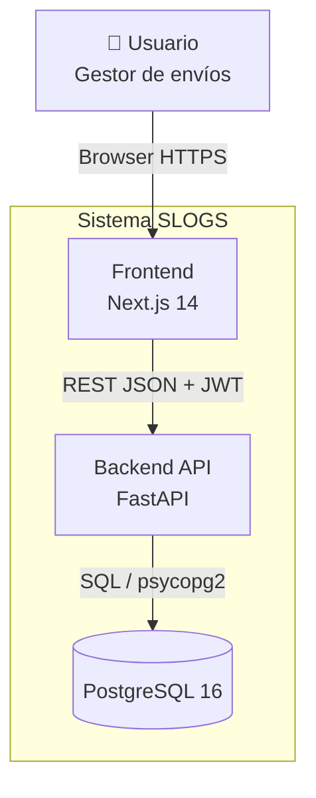
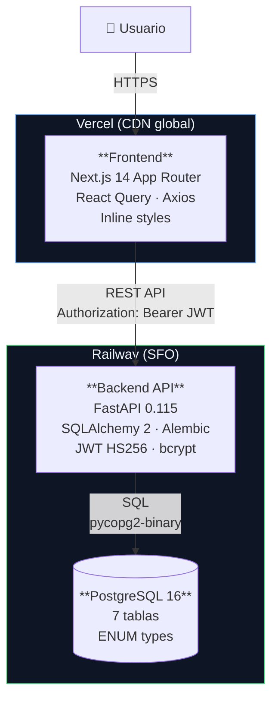
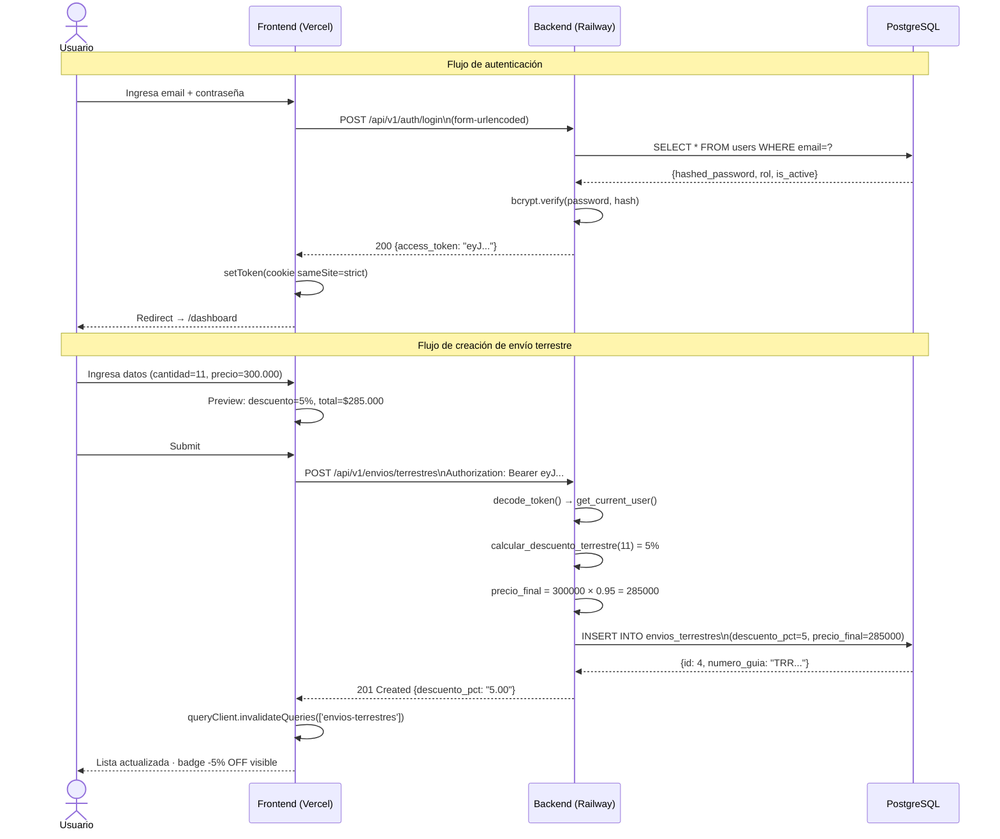
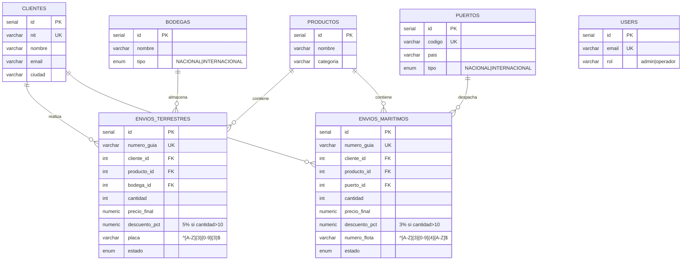

# SLOGS — Diagramas de Arquitectura

_Modelo C4 simplificado: Contexto → Contenedores → Componentes → Secuencia_

---

## 1. Diagrama de Contexto (C4 Level 1)

---

## 2. Diagrama de Contenedores (C4 Level 2)

---

## 3. Diagrama de Componentes — Backend (C4 Level 3)

```mermaid
graph TB
    subgraph "FastAPI Application"
        direction TB

        subgraph Routers["Capa Router (HTTP)"]
            R_auth["auth.py\nPOST /login /register\nGET /me"]
            R_env["envios.py\nCRUD terrestres\nCRUD marítimos"]
            R_mae["clientes · productos\nbodegas · puertos"]
            R_exp["export.py\nGET /export CSV"]
            R_dash["dashboard.py\nGET /stats"]
        end

        subgraph Services["Capa Service (Negocio)"]
            S_auth["auth_service\nJWT · bcrypt"]
            S_ter["envio_terrestre_service\ncalcular_descuento 5%"]
            S_mar["envio_maritimo_service\ncalcular_descuento 3%"]
            S_mae["cliente · producto\nbodega · puerto services"]
        end

        subgraph Repos["Capa Repository (Datos)"]
            Rep["*_repo.py\nSQLAlchemy queries\nsin lógica de negocio"]
        end

        subgraph Cross["Transversales"]
            Dep["dependencies.py\nget_current_user\nrequire_admin"]
            Sch["schemas/\nPydantic DTOs\nCreate · Update · Response"]
        end
    end

    DB[("PostgreSQL 16")]

    Routers -->|"llama"| Services
    Services -->|"delega BD"| Repos
    Repos -->|"ORM"| DB
    Routers -.->|"inyecta"| Dep
    Routers -.->|"valida"| Sch

    style Routers fill:#111827,stroke:#F59E0B
    style Services fill:#111827,stroke:#60A5FA
    style Repos fill:#111827,stroke:#4ADE80
    style Cross fill:#111827,stroke:#475569
```

**Regla de capas:** cada capa solo conoce la siguiente. El router nunca toca SQLAlchemy. El repositorio nunca lanza `HTTPException`.

---

## 4. Diagrama de Secuencia — Login y Crear Envío

---

## 5. Diagrama de Base de Datos (ER simplificado)

